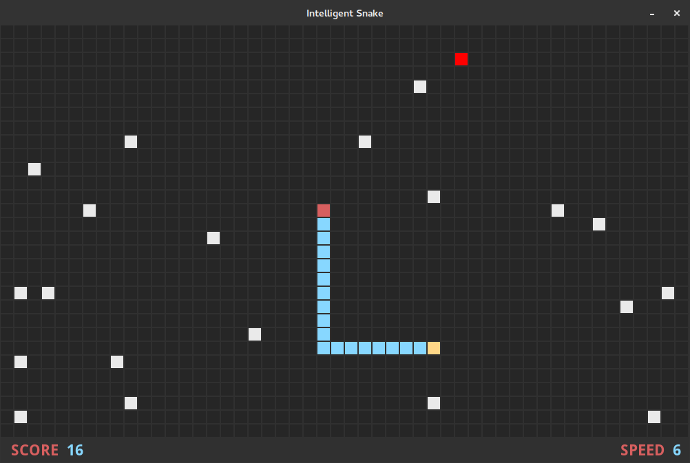

# Intelligent Snake #

Intelligent Snake is a simple clone of the famous **snake**-style games. It's meant both as a fun time waster as well as a simple working SDL program to learn from and use as a reference.

## Compile ##

### Linux ###

#### Requirements ####

* **make**
* **gcc**
* **SDL** (version 1.2)
* **SDL_ttf**

#### Build ####

* `make`: Build Intelligent Snake and copy required files to ./bin/
* `make clean`: Remove build directories

### Windows ###

#### Requirements ####

* **make**
* **mingw-w64**
* **mingw-w64-sdl** (version 1.2)
* **mingw-w64-sdl_ttf**

#### Build ####

* `make windows`: Build Intelligent Snake for Windows and copy required files to ./windows-bin/
* `make clean`: Remove build directories

**Note**: The Makefile assumes mingw32 is installed to /usr/x86_64-w64-mingw32/, and you should edit MINGW and MINGWPATH if your system installs it elsewhere.

## Commands ##

Usage: `./isnake [options]`

### Options ###

* `./isnake`: Start the game with the default options
* `./isnake -g [width] [height]`: Set the grid size: between [30]x[20] and [80]x[50] (DEFAULT: [50]x[30])
* `./isnake -b [blocks]`: Set the number of blocks: between [0] and [40] (DEFAULT: [20])
* `./isnake -l [length]`: Set the snake's starting length: between [3] and [35] (DEFAULT: [3])
* `./isnake -s [speed]`: Set the snake's starting speed: between [1] and [9] (DEFAULT: [1])
* `./isnake -2`: Double the size the game renders at
* `./isnake -h`: Display help information

## Controls ##

* **Movement**
  * **FPS Keys**: `w`, `a`, `s` and `d`
  * **Vim Keys**: `k`, `h`, `j` and `l`
  * **Arrow Keys**: `up`, `left`, `down` and `right`
* **Quit**: `Escape` and `q`
* **Restart** (after death): `Space` and `Return`

## Credits ##

* Written by Kevin MacMartin: [GitHub Projects](https://github.com/prurigro?tab=repositories) | [Arch Linux AUR Packages](https://aur.archlinux.org/packages/?SeB=m&K=prurigro)

## License ##

* **Intelligent Snake**: [The MIT License](http://opensource.org/licenses/MIT)
* **Font** ([DroidSans-Bold.ttf](https://www.google.com/fonts/specimen/Droid+Sans)): [Apache License, version 2.0](http://www.apache.org/licenses/LICENSE-2.0.html)
